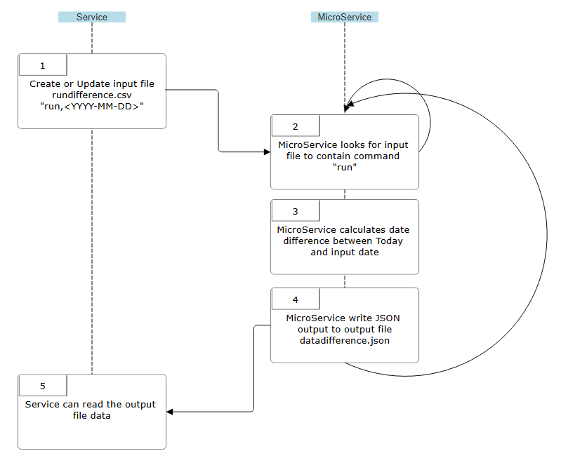

## Description
Microservice "A" to perform date difference calculations between today and the date provided.

## Run
Run the microservice via: `python3 run.py`. CTRL-C to stop.

## Tests
```python
python3 -m pytest
```

## Communication Contract
### Input
In file `rundifference.csv`:
```csv
run,<date>
```
`<date>` shall be in YYYY-MM-DD format.

The microservice will blank this file after running.

### Output
In file `datadifference.json`
```json
{
    "days": <Integer>,
    "months": <Integer>,
    "years": <Integer>
}
```

Negative values are possible and represent a date in the future from today.

The values are not additive. The date difference is not the sum of years, months, days.
Each value is the total difference in itself. All values are truncated (not rounded).

### UML Diagram

